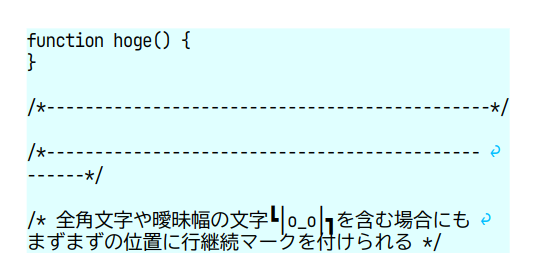

# vivliostyle-util-insert-line-continuation-marker

Add line continuation markers to elements.

## License

This project is licensed under [GPL-3.0](LICENSE), except that everything in the `example` directory is released under CC0.
